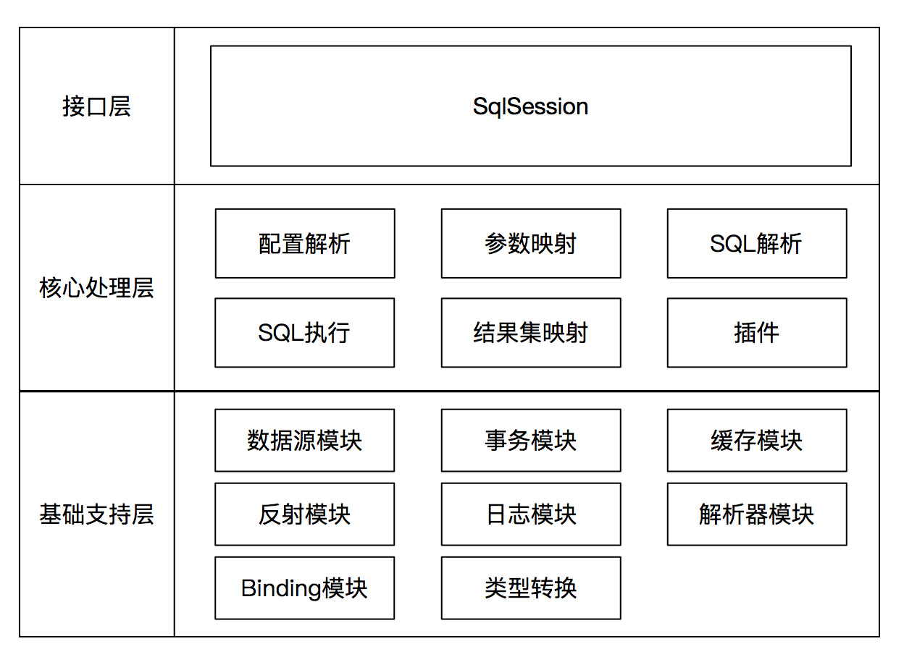
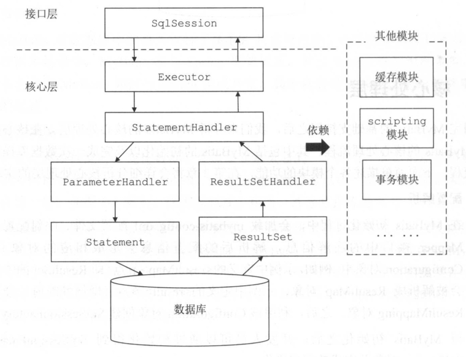

# MyBatis整体介绍

## 什么是MyBatis

MyBatis 是一款优秀的**持久层**框架，它支持定制化 SQL、存储过程以及高级映射。MyBatis **避免了几乎所有的 JDBC 代码和手动设置参数以及获取结果集**。MyBatis 可以使用简单的 XML 或注解来配置和映射原生信息，将接口和 Java 的 POJOs(Plain Old Java Objects,普通的 Java对象)映射成数据库中的记录。

[MyBatis文档教程](http://www.mybatis.org/mybatis-3/zh/project-info.html)

## Mybatis架构



### 基础支持层

是整个MyBatis的基础模块，为核心处理层的功能提供了良好的支撑。主要功能：

* 反射模块
* 类型转换模块
* 日志模块
* 资源加载模块
* 数据源模块
* 事务管理
* 缓存模块
* Binding模块


### 核心处理层

核心处理层中实现了`MyBatis`的核心处理流程， 其中包括`MyBatis`的初始化以及完成**一次数据库操作**的涉及的全部流程。

* 配置解析

  在`MyBatis`初始化过程中， 会加载`mybatis-config.xml`配置文件、映射配置文件以及`Mapper`接口中的注解信息，解析后的配置信息会形成相应的对象并保存到`Configuration`对象中。

* SQL解析

* SQL执行

  SQL 语句的执行涉及多个组件，其中比较重要的是 Executor、 StatementHandler、ParameterHandler 和 ResultSetHandler。 Executor 主要负责维护一级缓存和二级缓存，并提供事务管理的相关操作，它会将数据库相关操作委托给 StatementHandler 完成。 StatementHandler 首先通过 ParameterHandler 完成 SQL 语句的实参绑定， 然后通过 java.sql.Statement 对象执行 SQL 语句并得到结果集，最后通过ResultSetHandler 完成结果集的映射，得到结果对象并返回。

  

* 插件

### 接口层

核心就是`SqlSession`接口，该接口中定义了`MyBatis`暴露给应用程序调用的 API， 也就是上层应用与 MyBatis 交互的桥梁。 接口层在接收到调用请求时，会调用核心处理层的相应模块来完成具体的数据库操作 。


# SqlSessionFactory

## 简介

SqlSessionFactory是MyBatis框架中的一个接口,主要负责MyBatis框架**初始化操作**以及为开发人员提供**SqlSession**对象.

```java
public interface SqlSessionFactory {

  SqlSession openSession();

  SqlSession openSession(boolean autoCommit);
  SqlSession openSession(Connection connection);
  SqlSession openSession(TransactionIsolationLevel level);

  SqlSession openSession(ExecutorType execType);
  SqlSession openSession(ExecutorType execType, boolean autoCommit);
  SqlSession openSession(ExecutorType execType, TransactionIsolationLevel level);
  SqlSession openSession(ExecutorType execType, Connection connection);

  Configuration getConfiguration();

}
```

## 创建SqlSessionFactory基本执行流程

1. 调用 SqlSessionFactoryBuilder 对象的 build(inputStream) 方法；

   ```java
   // 获取配置文件流
   InputStream is = Resources.getResourceAsStream("mybatis-config.xml");
   
   SqlSessionFactoryBuilder builder = new SqlSessionFactoryBuilder();
   // SqlSessionFactory：SqlSession工厂类，以工厂形式创建SqlSession对象，采用了Factory工厂设计模式
   SqlSessionFactory factory = builder.build(is);
   ```

   

2. SqlSessionFactoryBuilder 会根据输入流 inputStream 等信息创建XMLConfigBuilder 对象 ; 

3. SqlSessionFactoryBuilder 调用 XMLConfigBuilder 对象的 parse() 方法；

   ```java
   // SqlSessionFactoryBuilder：SqlSessionFactory的构造器，用于创建SqlSessionFactory，采用了Builder设计模式
   public SqlSessionFactory build(InputStream inputStream, String environment, Properties properties) {
       try {
         XMLConfigBuilder parser = new XMLConfigBuilder(inputStream, environment, properties);
         return build(parser.parse());
       } catch (Exception e) {
         throw ExceptionFactory.wrapException("Error building SqlSession.", e);
       } finally {
         ErrorContext.instance().reset();
         try {
           inputStream.close();
         } catch (IOException e) {
           // Intentionally ignore. Prefer previous error.
         }
       }
     }
   
   ```

   

4. XMLConfigBuilder 对象返回 Configuration 对象；

   ```java
   // Configuration：该对象是mybatis-config.xml文件中所有mybatis配置信息
   public Configuration parse() {
       if (parsed) {
         throw new BuilderException("Each XMLConfigBuilder can only be used once.");
       }
       parsed = true;
       parseConfiguration(parser.evalNode("/configuration"));
       return configuration;
     }
   
     private void parseConfiguration(XNode root) {
       try {
         //issue #117 read properties first
         propertiesElement(root.evalNode("properties"));
         Properties settings = settingsAsProperties(root.evalNode("settings"));
         loadCustomVfs(settings);
         typeAliasesElement(root.evalNode("typeAliases"));
         pluginElement(root.evalNode("plugins"));
         objectFactoryElement(root.evalNode("objectFactory"));
         objectWrapperFactoryElement(root.evalNode("objectWrapperFactory"));
         reflectorFactoryElement(root.evalNode("reflectorFactory"));
         settingsElement(settings);
         // read it after objectFactory and objectWrapperFactory issue #631
         environmentsElement(root.evalNode("environments"));
         databaseIdProviderElement(root.evalNode("databaseIdProvider"));
         typeHandlerElement(root.evalNode("typeHandlers"));
         mapperElement(root.evalNode("mappers"));
       } catch (Exception e) {
         throw new BuilderException("Error parsing SQL Mapper Configuration. Cause: " + e, e);
       }
     }
   ```

   

5. SqlSessionFactoryBuilder创建一个DefaultSessionFactory 对象,并将Configuration对象作为参数传给DefaultSessionFactory对象；

   ```java
   public SqlSessionFactory build(Configuration config) {
       return new DefaultSqlSessionFactory(config);
     }
   ```

   

6. SqlSessionFactoryBuilder 返回 DefaultSessionFactory 对象给 Client ，供 Client使用。
   Client可以使用DefaultSessionFactory对象创建需要的SqlSession.

   ```java
   SqlSession sqlSession = factory.openSession();
   DeptMapper mapper = sqlSession.getMapper(DeptMapper.class);
   ```


# SqlSession


# Executor

## 简介

每一个SqlSession对象都会拥有一个Executor(执行器对象);这个执行对象负责[增删改查]的具体操作.我们可以简单的将它理解为JDBC中Statement的封装版.